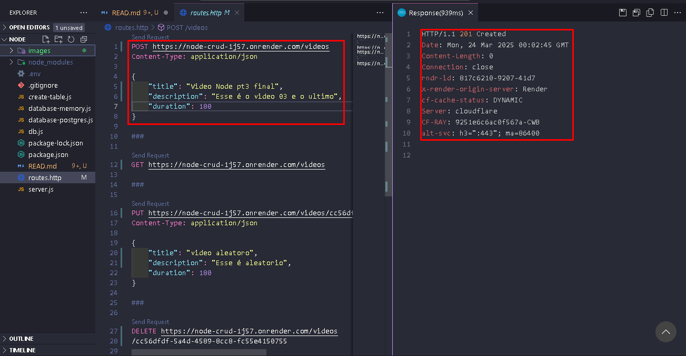
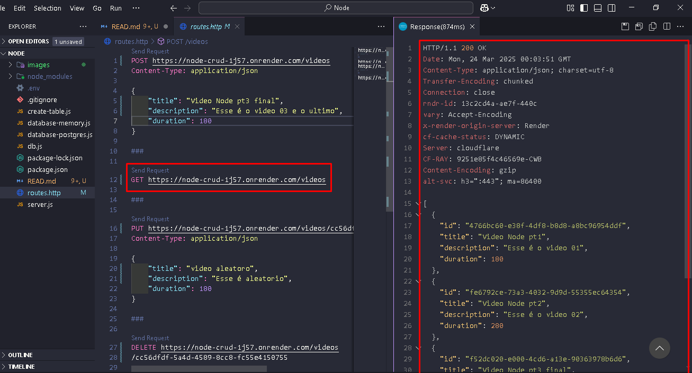
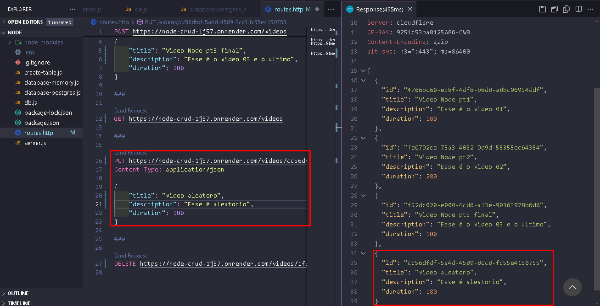
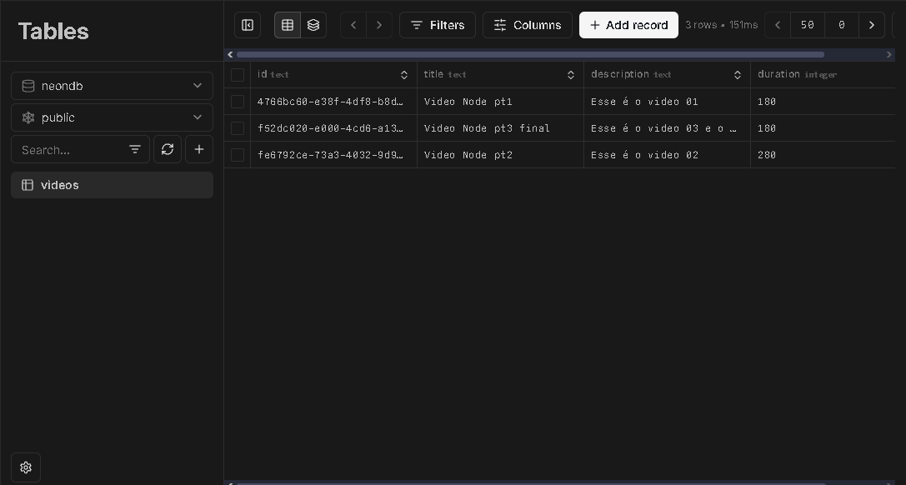
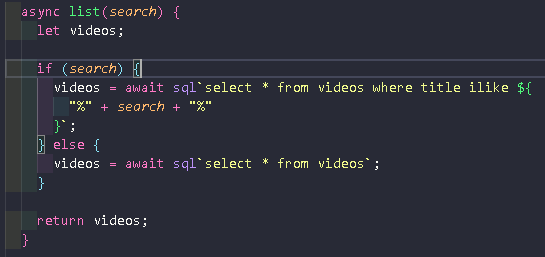
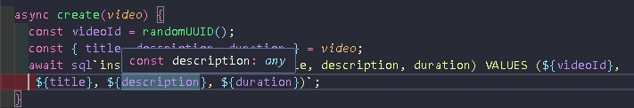
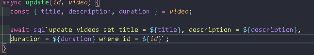
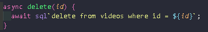

## 🛠️ **Tecnologias Utilizadas**

### **Fastify**

- Um framework web altamente eficiente para Node.js. Utilizado para criar o servidor da API e as rotas para manipulação dos dados.

### **Node.js**

- Ambiente de execução JavaScript no servidor, essencial para rodar a API e realizar operações assíncronas.

### **PostgreSQL**

- Sistema de gerenciamento de banco de dados relacional utilizado para armazenar os dados dos vídeos.

### **node:crypto**

- Biblioteca do Node.js usada para gerar identificadores únicos (UUID) para garantir que cada vídeo tenha um ID exclusivo.

---

## 📝 **Funcionalidade da API**

A API implementa as funcionalidades básicas de **CRUD** (Create, Read, Update, Delete) para vídeos. Aqui está o que cada operação faz:

### 1. **POST /videos** - Criar Vídeo 🆕

- **Objetivo**: Cria um novo vídeo no banco de dados.
- **Funcionamento**: O cliente envia o título, descrição e duração do vídeo, e um ID único é gerado para o vídeo.
- **Resposta**: Retorna **201 (Created)**, indicando que o vídeo foi criado com sucesso.

---

### 2. **GET /videos** - Listar Vídeos 📃

- **Objetivo**: Lista todos os vídeos armazenados no banco de dados.
- **Funcionamento**: É possível filtrar os vídeos com um termo de pesquisa no título.
- **Resposta**: Retorna a lista de vídeos (ou vídeos filtrados).

---

### 3. **PUT /videos/:id** - Atualizar Vídeo ✏️

- **Objetivo**: Atualiza as informações de um vídeo específico.
- **Funcionamento**: O cliente envia os dados atualizados (título, descrição e duração) e o ID do vídeo a ser atualizado.
- **Resposta**: Retorna **204 (No Content)**, indicando que a atualização foi bem-sucedida.

---

### 4. **DELETE /videos/:id** - Deletar Vídeo 🗑️

- **Objetivo**: Deleta um vídeo específico do banco de dados.
- **Funcionamento**: O cliente envia o ID do vídeo a ser deletado.
- **Resposta**: Retorna **204 (No Content)**, indicando que o vídeo foi removido com sucesso.

---

## 🗄️ **Interação com o Banco de Dados**

A comunicação com o banco de dados é realizada por meio da classe `DatabasePostgres`, que contém os métodos para manipulação das tabelas no banco de dados. Cada operação CRUD é realizada de forma eficiente com SQL.

---

### Métodos da Classe `DatabasePostgres`

1. **list(search)**:
   - **Objetivo**: Lista todos os vídeos ou filtra pela pesquisa do título.
   - **Funcionamento**: Se um parâmetro de pesquisa (`search`) for fornecido, a consulta será filtrada pelo título. Caso contrário, retorna todos os vídeos.

2. **create(video)**:
   - **Objetivo**: Insere um novo vídeo no banco de dados.
   - **Funcionamento**: Gera um ID único para o vídeo e insere os dados no banco de dados.

3. **update(id, video)**:
   - **Objetivo**: Atualiza os dados de um vídeo existente com base no ID fornecido.
   - **Funcionamento**: A consulta SQL é executada para atualizar as informações do vídeo.

4. **delete(id)**:
   - **Objetivo**: Deleta um vídeo do banco de dados com o ID especificado.
   - **Funcionamento**: A consulta SQL remove o vídeo correspondente do banco de dados.

---

## 🛠️ **Melhorias Possíveis**

Embora a API já tenha as funcionalidades básicas, algumas melhorias podem ser feitas:

- **Tratamento de Erros**: Implementar middleware de tratamento de erros para uma resposta mais robusta e amigável.
- **Validação de Dados**: Adicionar validação de entrada para garantir que os dados enviados pelo cliente sejam válidos e corretos.
- **Autenticação**: Implementar autenticação de usuários para permitir que apenas usuários autorizados acessem certas funcionalidades.
- **Testes Automatizados**: Criar testes unitários e de integração para garantir que a API funcione corretamente sob diferentes condições.

---

## ✅ **Conclusão**

Este projeto foi uma excelente oportunidade de aprendizado para entender como construir uma API simples e funcional com **Fastify** e **PostgreSQL**. Ele me proporcionou uma compreensão mais profunda de como lidar com operações de banco de dados e como estruturar uma API para realizar operações básicas de CRUD.

Através deste projeto, pude aprimorar minhas habilidades de desenvolvimento de backend e melhorar minha compreensão sobre a integração de frameworks e bancos de dados em sistemas reais.

---
